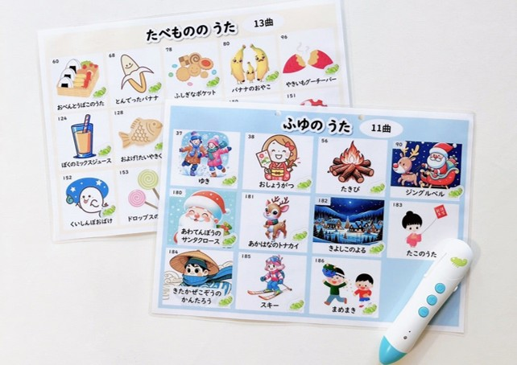

# 音声ペン対応　くもんのうたシート 
 

 
 
 
音声ペン対応している「くもんのうたシート」を作りました！  
 
 
 
## データシェア
 
 
データはこちらから
 
 
これからも随時シートを追加予定です！
 
 
 
## 制作に至った意図  
 
 
 
0歳の時に買ってよかった
「くもんのうた200絵本」
 
 
 
購入はこちらから  
 
 
 
こちら、なんといってもすごいのが  
**200曲**も入っているところ！！  
 
 
 
圧倒的曲数で、知育ママ達の御用達と言っても  
過言ではない商品です👍
 
 
 
なのですが、使っているうちに１つ思うことがあり、  
自分でタッチ出来て操作できるうた絵本のように  
 
 
 
**子どもが自分で曲を選んで聞く**ことができたら  
もっといいなぁとずっと思っていました🥹  
 
 
 
## コダワリポイント  
 
 
 
- 箇条書き
- 箇条書き02
- 箇条書き03
 
 
## 音声ペンはカメレオンリーダーを使用
 
- 箇条書き
- 箇条書き02
- 箇条書き03

[markdown](https://growi.cloud/blog/738) と呼ばれる文法

